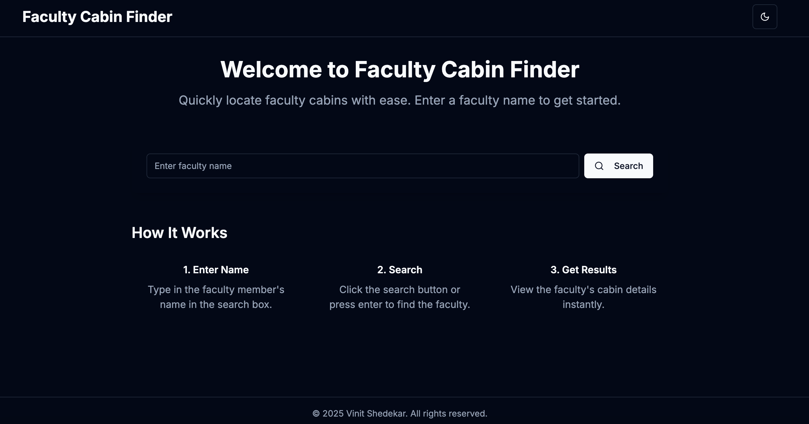

# Faculty Cabin Finder 🕵️‍♂️

A modern web application that helps users locate faculty cabins by searching faculty names. Built with Next.js and Tailwind CSS, this application provides a clean, responsive interface with dark/light theme support.




## 🌟 Features

- **Simple Search**: Quickly find faculty cabin locations by name
- **Detailed Results**: View comprehensive cabin details (building, floor, room number, etc.)
- **Responsive Design**: Works perfectly on all devices
- **Dark/Light Mode**: Toggle between themes for comfortable viewing
- **No Scrolling Required**: All content fits within a single viewport
- **Excel Data Integration**: Easy to update faculty information

## 🚀 Live Demo

[View Live Demo](https://faculty-cabin-finder.vercel.app)

## 💻 Tech Stack

- **Framework**: [Next.js](https://nextjs.org/)
- **Styling**: [Tailwind CSS](https://tailwindcss.com/)
- **UI Components**: [shadcn/ui](https://ui.shadcn.com/)
- **Icons**: [Lucide React](https://lucide.dev/)
- **Data Parsing**: [xlsx](https://sheetjs.com/)

## 📋 Prerequisites

- Node.js (v14.0.0 or later)
- npm or yarn

## 🔧 Installation

1. Clone the repository:
   ```bash
   git clone https://github.com/vinitshedekar/faculty-cabin-finder.git
   cd faculty-cabin-finder
   ```

2. Install dependencies:
   ```bash
   npm install
   ```

3. Run the development server:
   ```bash
   npm run dev
   ```

4. Open [http://localhost:3000](http://localhost:3000) to view it in your browser.

## 📄 License

This project is licensed under the MIT License.
